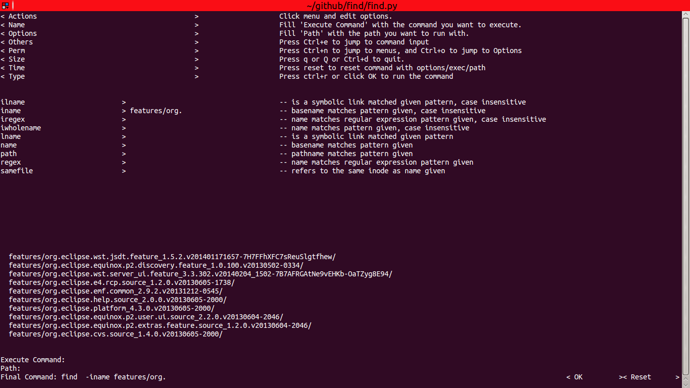

# find

[](http://travis-ci.org/spacewander/find)

Wrap find(1) with terminal UI. Tested with Python 2.7/3.2/3.4

## Why I write it?

At first, I always switch between `man find` and `find: missing argument to '-exec'` or other stuff, when trying to make find(1) work.
Therefore, I wrote a checklist, to make life easier. 
From then on, I always switch between the checklist and `find ...` to make find(1) work correctly.
At least I saved myself from typing `man find`.

Finally, I couldn't bear it anymore. So this tool, which I hope to solve the problem met, is created.

It is a terminal UI wrapper, so it can be used in both desktop environment and remote server.

## Who will be interested in it?

Guys uses find(1) in terminal sometimes and feel it too complex to work with, like me. 

## How to use it?

### Step 0 : download it to somewhere

```
cd somewhere
# clone and checkout latest tag
git clone https://github.com/spacewander/find && git checkout $(git describe --tags $(git rev-list --tags --max-count=1))
[sudo] pip install -r requirements.txt
```

Or download it via pip
```
[sudo] pip install findtui
```

### Step 1 : alias it as find/findtui

If you install it via pip, you can skip this section, just run it with `findtui`.

Add this line to your shell configuration: `alias findtui somewhere/find/main.py`.
You can alias it as `find`, too. However, if you do this in zsh, zsh will refuse to provide argument completition for `find`. Zsh hates cheat.
This is not a problem in bash, since bash doesn't provide special completition for find.

That's all. Now you can run it with `findtui`:



### Features

1. zsh like auto-completition

    [](https://asciinema.org/a/19793)
  
2. choose your options with terminal UI
  
    [](https://asciinema.org/a/19794)

3. terminal shortkeys

    [](https://asciinema.org/a/19795)
  
    Currently supported shortkeys:

    | key name        | default value    | desceiption |
    | ----------------|-------------   | ----------- |
    | JUMP_TO_MENUS   | ctrl n         | jump to menus |
    | JUMP_TO_OPTIONS | ctrl o         | jump to options panel|
    | JUMP_TO_COMMAND | ctrl e         | jump to command input |
    | TRIGGER_COMPLETITION | tab       | trigger completition |
    | RUN_KEY | ctrl r, enter         | run the command |
    | EXIT_KEY | q, Q, ctrl d         | quit |

    You can use environment variable to specific them, like `RUN_KEY='shift meta c' findtui`.

4. support both GNU version and BSD version

## More idea?

If you have any ideas to make this tool more useful/efficient, don't hesitate in sending a pr or opening an issue.
