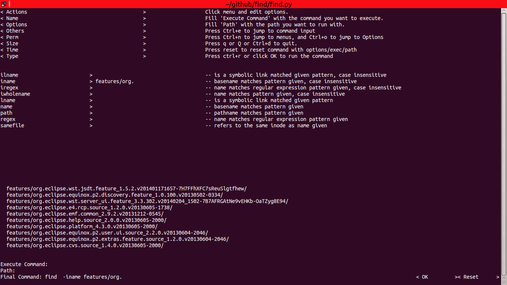

给find命令添加一个终端界面（TUI），支持Python 2.7+

## 我为什么要写这个东西呢？

以前，为了能把 find 命令写对，我总是不得不在两个终端间切换。其中一个运行着 `man find`，另一个则是 `find ...`。
尽管如此，还是摆脱不了诸如`find: 缺少“-exec”参数`这样让人摸不着头脑的错误提示。

后来我整理了一份checklist，这样就不用担心忘记哪个选项是干什么的。从此以后，我总是不得不在checklist和终端间切换。

能不能把checklist和终端合二为一呢？于是我忍无可忍，无须再忍，抽出一段时间写了这个东西：

一个包装了find命令的终端界面程序。


虽然是终端界面，但是你还是可以拿起鼠标点点点；正因为是终端界面，你也可以在你的VPS上使用它。

## 谁会对它感兴趣？

向我这样，偶尔需要在终端下运行 find，却因为记不住那么多个选项而气馁的人。

## 如何使用？

### 用pip安装（推荐）

直接运行pip：

```
[sudo] pip install findtui
```

然后敲入 `findtui` 即可使用：


### 手动安装

先把代码克隆下来：

```
cd somewhere
# clone and checkout latest tag
git clone https://github.com/spacewander/find && git checkout $(git describe --tags $(git rev-list --tags --max-count=1))
[sudo] pip install -r requirements.txt
```

在你的shell配置中添加这么一行： `alias findtui somewhere/find/main.py`，刷新你的shell配置。（比如`. ~/.bashrc`）
然后就能敲入 `findtui` 运行了。

### 特性

1. 效仿 zsh 的自动补全

    [](https://asciinema.org/a/19793)
  
2. 从终端界面中选取你的选项
  
    [](https://asciinema.org/a/19794)

3. 终端界面快捷键

    [](https://asciinema.org/a/19795)
  
    当前支持的快捷键：

    | 快捷键          | 默认值         | 描述 |
    | ----------------|-------------   | ----------- |
    | JUMP_TO_MENUS   | ctrl n         | 跳到菜单 |
    | JUMP_TO_OPTIONS | ctrl o         | 跳到选项面板|
    | JUMP_TO_COMMAND | ctrl e         | 跳到命令输入框 |
    | TRIGGER_COMPLETITION | tab       | 触发自动补全 |
    | RUN_KEY | ctrl r, enter         | 运行命令 |
    | EXIT_KEY | q, Q, ctrl d         | 退出 |

    你可以通过指定运行时环境变量来修改它们的值，比如`RUN_KEY='shift meta c' findtui`.

4. 对 GNU 版本的 find 和 BSD 版本的 find 都提供了包装

5. 给常用的选项列出了若干例子

    

## 你的想法？

如果你对于如何让这个工具更加高效易用有着自己的看法（或者有什么需要吐槽），请开一个issue或者发送一个pr。
